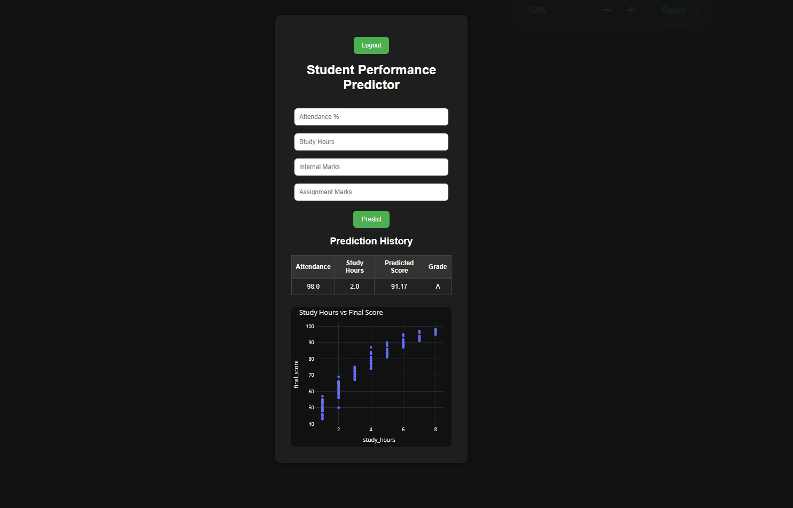

# 🎓 Student Performance Predictor

A full-stack Machine Learning web application that predicts student final scores based on academic inputs.

## 🚀 Live Demo

https://student-performance-predictor-1mlt.onrender.com

---

## 📌 Features

- 🔐 User Authentication (Login / Signup / Logout)
- 📊 Student Performance Prediction using Machine Learning
- 📈 Interactive Analytics Dashboard
- 🗂️ SQLite Database Integration
- 👤 User-Specific Prediction History
- 🌐 Fully Deployed Web Application

---

## 🛠️ Tech Stack

### Frontend
- HTML
- CSS

### Backend
- Flask
- SQLite

### Machine Learning
- Scikit-learn
- Pandas

### Data Visualization
- Plotly

### Deployment
- Render
- GitHub

---

## 📷 Screenshots

### Dashboard


### Login Page


### Signup Page


---

## ⚙️ Installation

Clone repository:

```bash
git clone YOUR_GITHUB_REPO_LINK