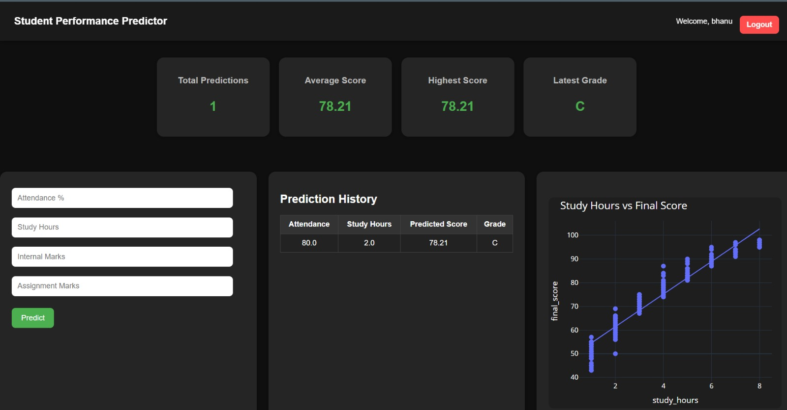
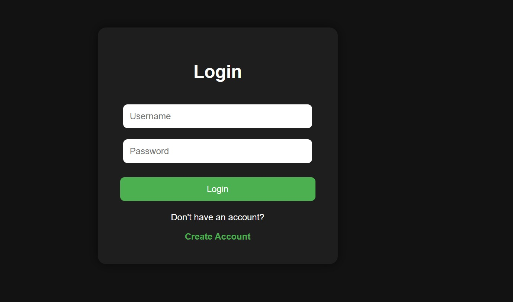
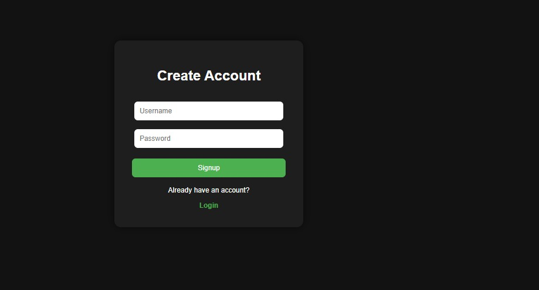

# 🎓 Student Performance Predictor

A full-stack Machine Learning web application that predicts student academic performance based on attendance, study hours, internal marks, and assignment scores.

The platform includes secure authentication, personalized prediction history, interactive analytics dashboards, and real-time data visualization — all deployed as a live web application.

---

# 🚀 Live Demo

🌐 https://student-performance-predictor-1mlt.onrender.com

---

# ✨ Features

* 🔐 Secure User Authentication (Signup / Login / Logout)
* 🔒 Password Hashing using Werkzeug Security
* 📊 Student Performance Prediction using Machine Learning
* 🧠 Linear Regression Model using Scikit-learn
* 📈 Interactive Analytics Dashboard with Trendline Graphs
* 📉 Real-Time Data Visualization using Plotly
* 👤 User-Specific Prediction History
* 🗂️ SQLite Database Integration
* 📱 Responsive Modern Dashboard UI
* 🌐 Fully Deployed Flask Web Application
* 🚀 GitHub + Render Deployment Integration

---

# 🧠 How It Works

The application collects:

* Attendance Percentage
* Study Hours
* Internal Marks
* Assignment Scores

These inputs are passed into a trained **Linear Regression model** built using **Scikit-learn**, which predicts the student's final academic score.

Predictions are then:

* stored in a SQLite database
* visualized using Plotly graphs
* displayed in a personalized analytics dashboard

---

# 🛠️ Tech Stack

## Frontend

* HTML
* CSS

## Backend

* Flask
* SQLite

## Machine Learning

* Scikit-learn
* Pandas
* NumPy
* Statsmodels

## Data Visualization

* Plotly

## Authentication & Security

* Werkzeug Password Hashing

## Deployment

* Render
* GitHub

---

# 📂 Project Structure

```bash
student-performance-predictor/
│
├── app.py
├── requirements.txt
├── predictions.db
├── student_data.csv
│
├── static/
│   └── style.css
│
├── templates/
│   ├── index.html
│   ├── login.html
│   └── signup.html
│
└── README.md
```

---

# 📷 Screenshots

## 🏠 Dashboard




## 🔐 Login Page




## 📝 Signup Page




---

# ⚙️ Installation

## Clone Repository

```bash
git clone https://github.com/AnushreeKasturi/student-performance-predictor.git
```

## Navigate to Project Folder

```bash
cd student-performance-predictor
```

## Install Dependencies

```bash
pip install -r requirements.txt
```

## Run Application

```bash
python app.py
```

---

# 🚀 Future Improvements

* AI-based academic recommendations
* PDF report generation
* Advanced analytics dashboard
* Dark/Light mode toggle
* Performance trend tracking
* Email notifications

---

# 👩‍💻 Author

**Anushree Kasturi**

GitHub:
https://github.com/AnushreeKasturi

---


